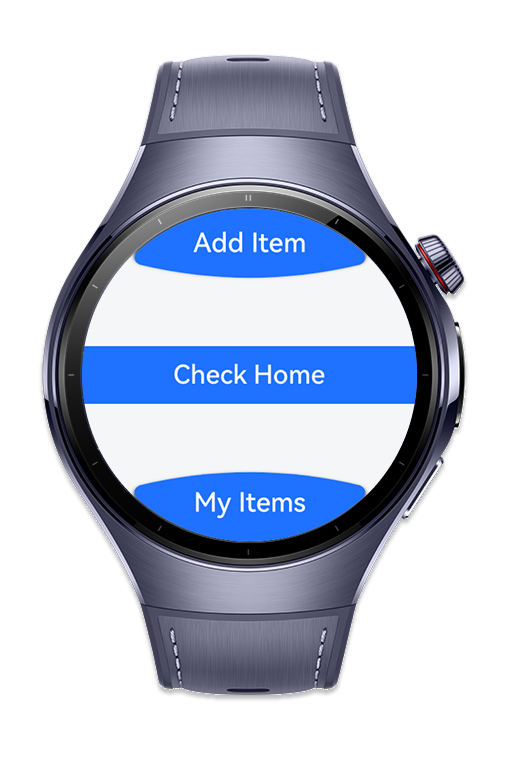
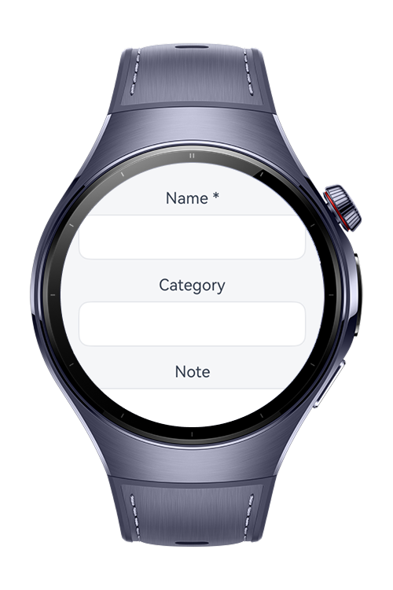
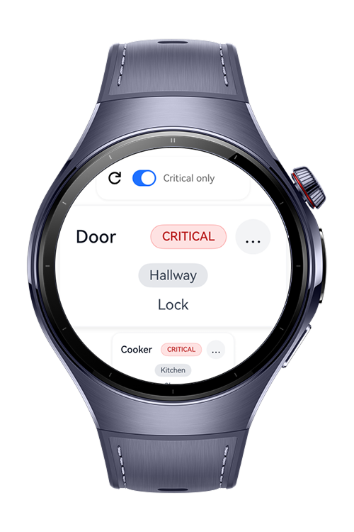
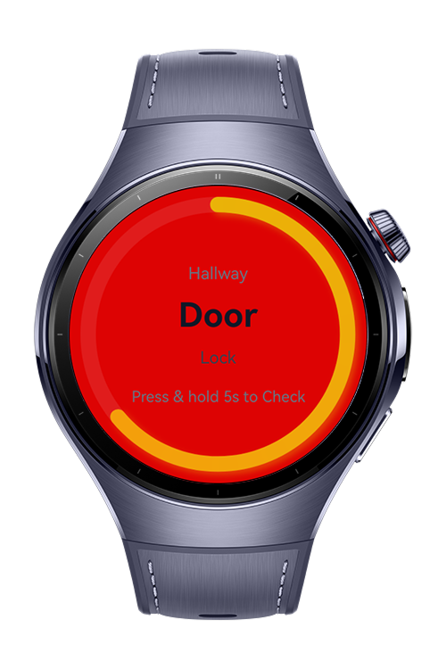

> **Note:** To access all shared projects, get information about environment setup, and view other guides, please visit [Explore-In-HMOS-Wearable Index](https://github.com/Explore-In-HMOS-Wearable/hmos-index).

# Home Check 

Home Check is a wearable application built for HarmonyOS. It helps users avoid forgetting essential items when leaving home. The app stores data using relationalStore from @kit.ArkData, allowing users to add, update, delete, and view items. On the Check Home screen, saved items are displayed one by one. By holding the screen for 5 seconds, users can cycle through the list and quickly check what they might forget.
# Preview

<div>
  
  
  
  
</div>

# Use Cases

- Before leaving home checklist: Ensure you don’t forget everyday essentials like keys, wallet, phone, or charger.
- Managing critical items: Keep track of important items such as medicine, documents, or work equipment.
- Customizable lists: Add, edit, or remove items according to your personal needs.
- Quick reminder flow: Use the long-press action to view items one by one in sequence for an easy and fast check.

# Tech Stack

- **Languages**: ArkTS, ArkUI, TypeScript
- **Frameworks**: HarmonyOS SDK 5.1.0(18)
- **Tools**: DevEco Studio Version 5.1.1.823
- **Libraries**:
    - `@kit.ArkUI`
    - `@kit.ArkTS`
    - `@kit.ArkData`
    - `@kit.BasicServicesKit`
    - `@kit.AbilityKit`
    - `@kit.PerformanceAnalysisKit`


# Directory Structure

```
├───common
│   ├───constants
│   │       CommonConstants.ets
│   │
│   └───utils
│           CommonUtils.ets
│           DBUtils.ets
│           Logger.ets
│
├───components
│       ArcButtonComponent.ets
│
├───entryability
│       EntryAbility.ets
│
├───entrybackupability
│       EntryBackupAbility.ets
│
└───pages
        AddItemPage.ets
        CheckHome.ets
        Index.ets
        MyItemsPage.ets

```

# Constraints and Restrictions
## Requirements
1. Configure signing settings.
2. Change module.json with your wearable app bundle name.
4. Change watch app bundle name with your bundle name.

## Supported Device

* Huawei Watch 5

# License

**Home Check** is distributed under the terms of the MIT License
See the [LICENSE](./LICENSE) for more information.